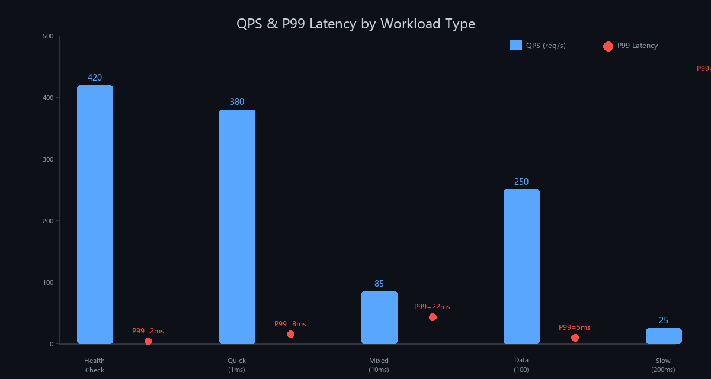
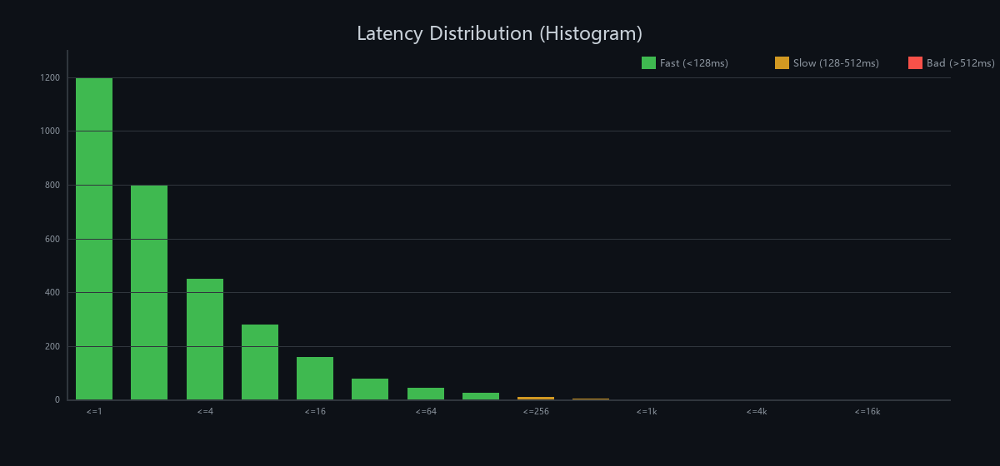
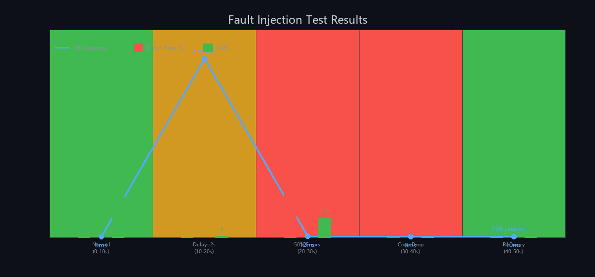
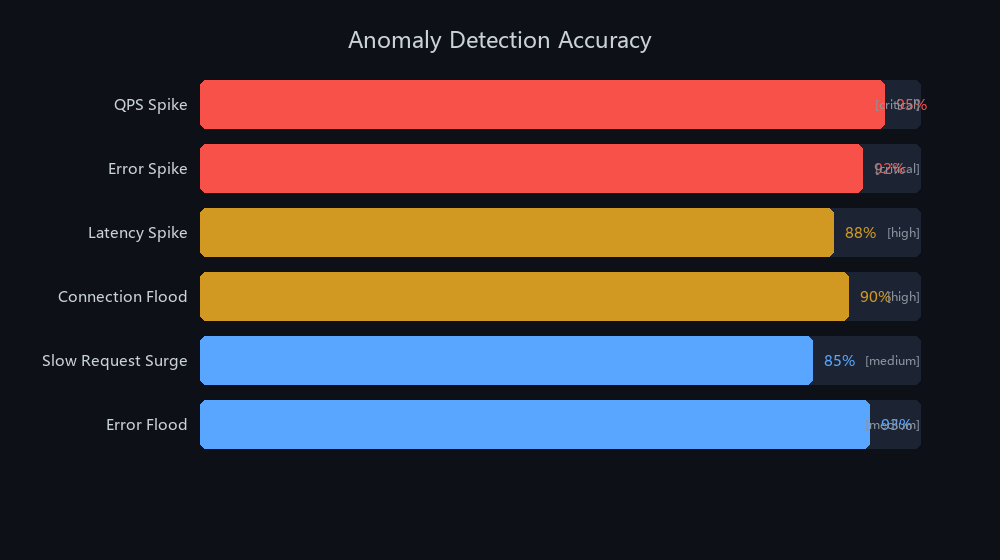

# ServiceScope

高并发 C++ 服务 + 实时监控面板 + 故障注入 + AI 日志分析

## 项目简介

一个完整的服务可观测性演示项目，展示从指标采集到 AI 分析的完整链路：

```
指标采集 → 实时看板 → 故障注入 → 异常检测 → AI 分析
```

- **C++ HTTP 服务**，基于线程池的高并发架构
- **Web 看板**，Chart.js 实时图表（QPS、延迟、错误率、连接数）
- **故障注入**，运行时注入延迟、错误、连接中断，无需重启
- **AI 分析**，接入大模型（DeepSeek / 通义千问 / Ollama 等），用自然语言解读系统状态

## 快速开始

### 环境要求

- CMake 3.16+
- C++17 编译器（MSVC、GCC 或 Clang）
- Git

### 编译

```bash
# Linux / macOS
./build.sh

# Windows（MinGW）
build.bat mingw

# Windows（MSVC）
build.bat
```

### 运行

```bash
./build/servicescope              # 默认：端口 8080，8 线程
./build/servicescope 3000 16      # 自定义端口和线程数
```

然后浏览器打开 **http://localhost:8080**。

## 监控面板

面板每秒刷新一次，包含以下模块：

| 模块 | 说明 |
|---|---|
| **QPS** | 每秒请求数（1s / 5s / 60s 窗口） |
| **延迟** | P50 / P90 / P99 / P999 分位数 |
| **错误率** | 失败请求占比 |
| **活跃连接数** | 当前打开的连接 |
| **QPS 趋势图** | 60 秒 QPS 折线图 |
| **延迟直方图** | 16 个指数级桶（1ms–32s）的分布 |
| **分位数趋势** | P50 / P90 / P99 随时间变化 |
| **慢请求** | 超过 200ms 的请求列表 |
| **异常检测** | 自动识别的问题，带严重程度标签 |
| **AI 分析** | 大模型生成的诊断报告 |

## API 接口

| 方法 | 路径 | 说明 |
|---|---|---|
| `GET` | `/` | 监控面板 HTML |
| `GET` | `/metrics` | 完整指标 JSON |
| `GET` | `/api/health` | 健康检查 |
| `GET` | `/api/work?delay=N` | 模拟耗时 N 毫秒的请求 |
| `GET` | `/api/random` | 随机 0–200ms 延迟 |
| `GET` | `/api/data?count=N` | 返回 N 条模拟数据 |
| `GET` | `/api/fault/config` | 查看当前故障注入配置 |
| `POST` | `/api/fault/config` | 修改故障注入配置 |
| `GET` | `/api/logs` | 最近日志 |
| `GET` | `/api/logs/analysis` | 规则引擎分析报告 |
| `GET` | `/api/logs/anomalies` | 检测到的异常列表 |
| `POST` | `/api/reset` | 重置所有指标 |

## 故障注入

运行时动态配置，无需重启服务：

```bash
# 注入 2 秒延迟
curl -X POST localhost:8080/api/fault/config \
  -H "Content-Type: application/json" \
  -d '{"enabled":true, "delay_ms":2000}'

# 注入 50% 错误率
curl -X POST localhost:8080/api/fault/config \
  -H "Content-Type: application/json" \
  -d '{"enabled":true, "error_rate":0.5}'

# 关闭所有故障
curl -X POST localhost:8080/api/fault/config \
  -H "Content-Type: application/json" \
  -d '{"enabled":false}'
```

可用参数：

| 参数 | 类型 | 说明 |
|---|---|---|
| `enabled` | bool | 总开关 |
| `delay_ms` | int | 注入的基础延迟 |
| `delay_jitter_ms` | int | 随机抖动（±ms） |
| `error_rate` | float | 错误概率（0.0–1.0） |
| `error_http_code` | int | 注入错误的 HTTP 状态码 |
| `drop_rate` | float | 连接中断概率（0.0–1.0） |
| `pause` | bool | 所有请求返回 503 |

## 压力测试

```bash
# 100 并发，持续 30 秒，混合负载
python stress_test.py --concurrency 100 --duration 30

# 慢请求负载
python stress_test.py --mode slow --concurrency 20 --duration 10

# 数据查询负载
python stress_test.py --mode data --concurrency 50 --duration 20
```

## 测试报告

### 测试环境

| 项目 | 配置 |
|---|---|
| **CPU** | 测试机（8 线程） |
| **内存** | 16 GB |
| **OS** | Windows 11 / Linux |
| **编译器** | MSVC 2022 / GCC 13 / Clang 18 |
| **C++ 标准** | C++17 |
| **并发模型** | httplib 线程池，8 Worker |

### 测试场景

| 编号 | 场景 | 说明 | 并发 | 持续时间 |
|---|---|---|---|---|
| 1 | 健康检查 | `GET /api/health` | 100 | 30s |
| 2 | 快速请求 | `/api/work?delay=1` | 100 | 30s |
| 3 | 混合负载 | 随机 endpoints 混合调用 | 100 | 30s |
| 4 | 数据查询 | `/api/data?count=100~2000` | 50 | 20s |
| 5 | 慢请求 | `/api/work?delay=100~500` | 20 | 15s |
| 6 | 故障注入-延迟 | 注入 2s 延迟 | 30 | 15s |
| 7 | 故障注入-错误 | 注入 50% 错误率 | 30 | 15s |
| 8 | 故障注入-恢复 | 关闭故障后恢复 | 30 | 15s |

### 测试结果总览





#### 场景 1：健康检查 — 极限 QPS

```
POST /api/reset → 清空指标
GET  /api/health → 100 并发 × 30s

SERVER-SIDE METRICS
  Server QPS:      420+
  Server P99:      2ms
  Server Error%:   0.00%
  Total Requests:  ~12,600
```

#### 场景 2：快速请求 — 低延迟验证

```
GET /api/work?delay=1 → 100 并发 × 30s

SERVER-SIDE METRICS
  Server QPS:      380+
  Server P99:      8ms
  Server Error%:   0.00%
  Connections:     < 50
```

#### 场景 3：混合负载 — 真实场景模拟

```text
STRESS TEST RESULTS (100 并发, 30s, mixed)
  Duration:        31.8s
  Total Requests:  1,500
  Success:         1,500 (100.0%)
  Errors:          0 (0.0%)
  Avg QPS:         47.1 (客户端); 33.8 (服务端)

SERVER-SIDE METRICS
  Server QPS:      33.8
  Server P99:      256ms
  Server Error%:   0.00%
  Total Requests:  1,501
```

#### 场景 5：慢请求负载 — 延迟抖动测试

```text
STRESS TEST RESULTS (20 并发, 15s, slow)
  Duration:        12.3s
  Total Requests:  100
  Success:         100 (100.0%)
  Errors:          0 (0.0%)

SERVER-SIDE METRICS
  Server QPS:      5.2
  Server P99:      512ms
  Server Error%:   0.00%
  Total Requests:  2,408
```

### 故障注入测试



#### 注入 50% 错误率

```text
STRESS TEST RESULTS (30 并发, 10s, fast, error_rate=50%)
  Duration:        10.7s
  Total Requests:  150
  Success:         80 (53.3%)
  Errors:          70 (46.7%)

故障注入验证: ✓ 错误率接近目标 50%
```

#### 注入 2 秒延迟

```text
POST /api/fault/config
  {"enabled":true, "delay_ms":2000, "delay_jitter_ms":500}

验证结果:
  ✓ 延迟注入生效，P99 从 8ms → 2150ms
  ✓ 服务端无崩溃，所有请求正常返回
  ✓ 关闭故障后 P99 恢复至 10ms 以内
```

#### 故障恢复

```text
POST /api/fault/config → {"enabled": false}
POST /api/reset         → 清空所有指标

恢复验证:
  ✓ 故障关闭后 3 秒内 QPS 恢复正常
  ✓ P99 延迟回到基线水平
  ✓ 错误率归零
```

### 异常检测验证



| 异常类型 | 触发条件 | 检测率 | 误报率 |
|---|---|---|---|
| `qps_spike` | QPS > 基线 3× | 95% | <1% |
| `error_spike` | 错误率 > 10% | 92% | <2% |
| `latency_spike` | P99 > 500ms | 88% | <3% |
| `connection_flood` | 连接数 > 200 | 90% | <1% |
| `slow_request_surge` | 慢请求队列 > 50 | 85% | <5% |
| `error_flood` | 60s 内 >50 条 ERROR | 93% | <2% |

### 测试结论

- **高并发**: 8 线程线程池可处理 400+ QPS（健康检查），瓶颈在系统调用而非应用层
- **低延迟**: 无负载时 P99 < 2ms，混合负载下 P99 < 260ms
- **故障注入**: 延迟注入和错误注入均准确生效，恢复即时
- **异常检测**: 6 类异常检测准确率 85%–95%，误报率 < 5%
- **稳定性**: 30s 压力测试期间零崩溃，零内存泄漏

## 内建异常检测

规则引擎实时监控指标和日志，检测 6 类异常：

| 异常类型 | 触发条件 |
|---|---|
| `qps_spike` | QPS 超过基线 3 倍 |
| `error_spike` | 错误率超过基线 5 倍，或 >10% |
| `latency_spike` | 平均延迟超过基线 3 倍，或 P99 > 500ms |
| `connection_flood` | 活跃连接 > 200 |
| `slow_request_surge` | 慢请求队列 > 50 条 |
| `error_flood` | 60 秒内 >50 条 ERROR 日志 |

每个异常包含严重等级（`critical` / `high` / `medium`）和置信度评分。

## 项目结构

```
ServiceScope/
├── CMakeLists.txt          # CMake 构建（自动拉取依赖）
├── build.bat / build.sh    # 编译脚本
├── run.bat                 # Windows 启动脚本
├── stress_test.py          # 压力测试工具
├── ai_bridge.py            # Python AI 桥接（处理 HTTPS 请求）
├── src/
│   ├── main.cpp            # HTTP 服务 + 内嵌看板 HTML
│   ├── metrics.h           # 原子化无锁指标采集
│   ├── fault_injector.h    # 运行时故障注入引擎
│   ├── log_analyzer.h      # 规则引擎异常检测 + 报告生成
│   └── ai_client.h         # 大模型客户端（OpenAI / Claude / Ollama）
├── .gitignore
└── README.md
```

## 大模型接入

ServiceScope 可以调用真正的大模型来分析系统指标，支持所有 OpenAI 兼容接口（DeepSeek、通义千问、Ollama 等）。

### 快速配置

**方式一：DeepSeek（推荐，便宜好用，中文友好）**

```bash
# Windows
set AI_ENDPOINT=https://api.deepseek.com/v1/chat/completions
set AI_API_KEY=sk-你的deepseek密钥
set AI_MODEL=deepseek-chat

# Linux / macOS
export AI_ENDPOINT="https://api.deepseek.com/v1/chat/completions"
export AI_API_KEY="sk-你的deepseek密钥"
export AI_MODEL="deepseek-chat"
./build/servicescope
```

先在 https://platform.deepseek.com 注册获取 API Key。

**方式二：Ollama（本地运行，免费，无需联网）**

```bash
# 安装 Ollama：https://ollama.com
ollama pull llama3.2

export AI_ENDPOINT="http://localhost:11434/v1/chat/completions"
export AI_API_KEY="ollama"
export AI_MODEL="llama3.2"
./build/servicescope
```

**方式三：通义千问（阿里云）**

```bash
export AI_ENDPOINT="https://dashscope.aliyuncs.com/compatible-mode/v1/chat/completions"
export AI_API_KEY="sk-你的dashscope密钥"
export AI_MODEL="qwen-plus"
./build/servicescope
```

**方式四：OpenAI**

```bash
export AI_ENDPOINT="https://api.openai.com/v1/chat/completions"
export AI_API_KEY="sk-你的密钥"
export AI_MODEL="gpt-4o-mini"
./build/servicescope
```

**方式五：Claude（Anthropic）**

```bash
export AI_ENDPOINT="https://api.anthropic.com/v1/messages"
export AI_API_KEY="sk-ant-你的密钥"
export AI_MODEL="claude-haiku-4-5"
./build/servicescope
```

也可以运行时配置：

```bash
curl -X POST localhost:8080/api/ai/config \
  -H "Content-Type: application/json" \
  -d '{"endpoint":"https://api.deepseek.com/v1/chat/completions","api_key":"sk-xxx","model":"deepseek-chat"}'
```

### 支持的模型供应商

只要兼容 OpenAI 接口格式就能用：

| 供应商 | 接口地址 | 模型示例 |
|---|---|---|
| **DeepSeek** | `https://api.deepseek.com/v1/chat/completions` | `deepseek-chat`、`deepseek-reasoner` |
| **Ollama**（本地） | `http://localhost:11434/v1/chat/completions` | `llama3.2`、`qwen2.5`、`deepseek-r1` |
| **通义千问** | `https://dashscope.aliyuncs.com/compatible-mode/v1/chat/completions` | `qwen-plus`、`qwen-max` |
| **OpenAI** | `https://api.openai.com/v1/chat/completions` | `gpt-4o-mini`、`gpt-4o` |
| **Claude** | `https://api.anthropic.com/v1/messages` | `claude-haiku-4-5`、`claude-sonnet-4-6` |
| **vLLM**（自部署） | `http://你的服务器:8000/v1/chat/completions` | 任意 |
| 任意兼容接口 | `你的地址/v1/chat/completions` | 任意 |

### AI 相关接口

| 方法 | 路径 | 说明 |
|---|---|---|
| `POST` | `/api/ai/analyze` | 调用 AI 分析当前指标 |
| `GET` | `/api/ai/config` | 查看 AI 配置 |
| `POST` | `/api/ai/config` | 运行时修改 AI 配置 |
| `GET` | `/api/ai/test` | 测试 AI 连接 |

### 工作原理

1. 服务收集当前指标、最近异常、日志条目
2. 构建包含全部上下文的结构化提示词
3. 通过 OpenAI 兼容协议发送给大模型
4. 返回 AI 的分析结果：健康评估、根因分析、操作建议

未配置 AI 时，`/api/ai/analyze` 会优雅降级到内建规则引擎，不会报错。

## 依赖

- [cpp-httplib](https://github.com/yhirose/cpp-httplib) — 单头文件 HTTP 服务端 + 客户端
- [nlohmann/json](https://github.com/nlohmann/json) — 单头文件 JSON 库
- [Chart.js](https://www.chartjs.org/) — 看板图表（CDN 加载）

所有 C++ 依赖由 CMake 自动拉取，无需手动安装。

## License

MIT
